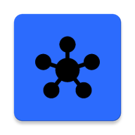

<p align="center">
  
</p>

<h1 align="center">bit Hub</h1>

<p align="center">
  <strong>Высокотехнологичная платформа для дистрибуции и управления Android-приложениями.</strong>
</p>

<p align="center">
  
  
  
  
  
</p>

---

## 🌟 Обзор

**bit Hub** — это современное решение для дистрибуции Android-приложений, построенное на стеке **Jetpack Compose** и **Material 3**. Платформа обеспечивает прямую доставку контента пользователям без посредников, поддерживает фоновую проверку обновлений через **WorkManager** и уведомления о новых версиях. Дизайн выполнен в фирменном стиле **bit Blue (#2C6CFF)** с поддержкой динамических цветов Material You.

---

## ✨ Ключевые возможности

| Возможность | Описание |
|---|---|
| 🚀 **Динамическая витрина** | Обновление списка приложений в реальном времени через Supabase |
| 📥 **Фоновая дистрибуция** | Нативная загрузка APK напрямую из GitHub Releases через системный `DownloadManager` |
| ⚡ **Смарт-инсталлятор** | Автоматический перехват завершённых загрузок и запуск установки |
| 🔔 **Push-уведомления** | Два канала уведомлений: установка приложений и проверка обновлений |
| 🕐 **Фоновая проверка** | Периодический `UpdateWorker` сверяет версию самого приложения с GitHub Releases |
| 🎨 **Гибкая тема** | Поддержка светлой, тёмной темы и системного режима через `ThemeMode` |
| 📡 **Умное подключение** | Настройки скачивания: только Wi-Fi или с мобильными данными через `DataStore` |
| 🌍 **Локализация** | Поддержка русского и английского языков |
| 🔒 **Безопасная архитектура** | Модульное разделение и защищённое хранение ключей через `secrets.properties` |

---

## 🗂 Архитектура приложения

```
com.bit.bithub
├── components/         # Переиспользуемые Compose-компоненты
│   ├── AppItems.kt
│   ├── DownloadButton.kt
│   ├── SettingsComponents.kt
│   ├── StoreSections.kt
│   └── UpdateBottomSheet.kt
├── data/               # Модели данных и репозитории
│   ├── AppModel.kt      # Модель App, AppRelease
│   ├── SettingsRepository.kt # Управление настройками через DataStore
│   ├── UpdateModels.kt  # Модели для обновлений (GitHub)
│   ├── UpdateRepository.kt # Проверка обновлений через GitHub API
│   └── UpdateViewModel.kt
├── navigation/         # Навигация (AppDestinations)
├── screens/            # UI-экраны
│   ├── AppDetailScreen.kt
│   ├── AutoUpdateSettingsScreen.kt # Настройки автообновления
│   ├── HomeScreen.kt
│   ├── ProfileScreen.kt
│   └── StoreScreen.kt
├── settings/           # Синглтон управления темой
│   └── SettingsManager.kt
├── ui/                 # Темы и стили (Material 3)
├── util/               # Утилиты (Installer, Wi-Fi check)
├── worker/             # Фоновые задачи
│   └── UpdateWorker.kt  # Периодическая проверка обновлений
├── MainActivity.kt
├── MainViewModel.kt    # Основная логика загрузки и списка приложений
└── bitHubApplication.kt # Инициализация Supabase и Notification Channels
```

---

## 🛠 Технологический стек

| Слой | Технологии                                                      |
|---|-----------------------------------------------------------------|
| **UI** | Jetpack Compose, Material 3, Adaptive Navigation Suite          |
| **Networking** | Ktor Client, Kotlinx Serialization                              |
| **Image Loading** | Coil                                                            |
| **Backend** | Supabase (Postgrest)                                            |
| **Local Storage** | Jetpack DataStore (Preferences)                                 |
| **Background Tasks** | WorkManager (CoroutineWorker)                                   |
| **Architecture** | MVVM, Clean Architecture                                        |
| **Notifications** | NotificationCompat, каналы `INSTALL_CHANNEL`, `UPDATES_CHANNEL` |
| **Min SDK** | 23 (Android 6.0+)                                               |
| **Target SDK** | 37 (Android 17)                                                 |
| **Language** | Kotlin 2.0+                                                     |

---

## Инструкция для разработчиков

### 1. Настройка окружения

Создайте файл `secrets.properties` в корневом каталоге проекта:

```properties
SUPABASE_URL=https://ваш-проект.supabase.co
SUPABASE_KEY=ваш-анонимный-ключ
```

> ⚠️ Файл `secrets.properties` добавлен в `.gitignore` — не передавайте ключи в репозиторий.

### 2. Схема данных (Supabase)

Приложение использует две связанные таблицы: `apps` и `app_releases`.

```sql
-- Таблица приложений
create table apps (
  id             bigint primary key generated always as identity,
  title          text not null,
  developer      text,
  rating         float8,
  description    text,
  icon_url       text,
  category       text,
  package_name   text,
  is_featured    boolean default false,
  created_at     timestamp with time zone default now()
);

-- Таблица релизов
create table app_releases (
  id             bigint primary key generated always as identity,
  app_id         bigint references apps(id) on delete cascade,
  platform       text default 'android',
  version_name   text,
  version_code   int,
  download_url   text,
  size_bytes     bigint,
  changelog      text,
  created_at     timestamp with time zone default now()
);

-- Публичный доступ на чтение (Row Level Security)
alter table apps enable row level security;
create policy "Allow public read access" on apps for select using (true);
alter table app_releases enable row level security;
create policy "Allow public read access" on app_releases for select using (true);
```

### 3. Фоновые задачи (WorkManager)

`UpdateWorker` проверяет наличие новых версий **bit Hub** на GitHub. Настройки хранятся в `SettingsRepository` (DataStore):

| Настройка | Описание |
|---|---|
| `backgroundUpdateCheck` | Включить фоновую проверку |
| `updateInterval` | Интервал проверки (по умолчанию 24ч) |
| `networkType` | Тип сети для проверки (Wi-Fi / Любая) |
| `appDownloadWifiOnly` | Скачивание приложений только по Wi-Fi |

При обнаружении обновлений пользователь получает уведомление в канале `UPDATES_CHANNEL`.

### 4. Каналы уведомлений

| ID | Назначение |
|---|---|
| `INSTALL_CHANNEL` | Успешная установка приложения |
| `UPDATES_CHANNEL` | Доступны обновления для bit Hub |

### 5. Стандарты именования

- Бренд: **bit Hub** (регистр «bit» всегда строчный).
- Package: `com.bit.bithub`.
- Entry Point: `BitHubApplication`.

### 6. Сборка и развёртывание

1. Выполните **Sync Project with Gradle Files**.
2. Убедитесь, что `secrets.properties` содержит актуальные ключи Supabase.
3. Соберите проект через **Build → Rebuild Project**.
