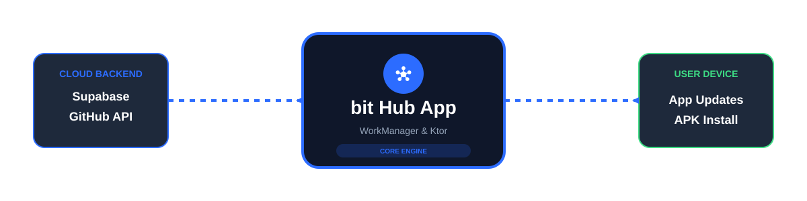

<p align="center">
  
</p>

<p align="center">
  
  
  
  
  
</p>

<p align="center">
  <a href="https://github.com/bit-Tecnologies/bit_hub/releases">
    
  </a>
  <a href="https://apps.obtainium.imranr.dev/redirect.html?r=obtainium://add/https://github.com/bit-Tecnologies/bit_hub/">
    
  </a>
  <a href="https://github-store.org/app?repo=bit-Tecnologies/bit_hub">
    
  </a>
</p>

---

## 🌟 Обзор

**bit Hub** — это современная высокотехнологичная платформа для дистрибуции Android-приложений. Мы объединили мощь **Jetpack Compose**, гибкость **Supabase** и надежность **GitHub API**, чтобы создать идеальный мост между разработчиком и пользователем. 

Платформа обеспечивает прямую доставку контента, поддерживает фоновые обновления через **WorkManager** и предлагает безупречный UI в стиле Material You.

<p align="center">
  
</p>

---


| Возможность | Описание |
|:---|:---|
| 🚀 **Dynamic Store** | Живая витрина приложений с мгновенным обновлением через Supabase. |
| 📥 **Direct DL** | Нативная загрузка APK напрямую из GitHub Releases через `DownloadManager`. |
| ⚡ **Smart Install** | Автоматический мониторинг завершенных загрузок и запуск установки. |
| 🕐 **Update Engine** | Фоновый `UpdateWorker` (каждые 24ч) сверяет версии приложения с GitHub. |
| 🎨 **Material You** | Динамические цвета, поддержка темной темы и адаптивная навигация. |
| 📡 **Smart Network** | Умное управление трафиком: выбор Wi-Fi или мобильных данных через DataStore. |

---


| Слой | Технологии |
|:---|:---|
| **UI Framework** | Jetpack Compose, Material 3, Adaptive Navigation Suite |
| **Networking** | Ktor Client, Kotlinx Serialization |
| **Data Engine** | Supabase (Postgrest), GitHub REST API |
| **Local Storage** | Jetpack DataStore (Preferences) |
| **Async Ops** | WorkManager, Kotlin Coroutines & Flow |
| **Image Loading** | Coil |

---

## 🗂 Архитектура проекта

```text
com.bit.bithub
├── components/         # Атомарные Compose-компоненты (Кнопки, Карточки)
├── data/               # Слой данных: Репозитории, Модели (Supabase + GitHub)
├── navigation/         # Типизированная навигация приложения
├── screens/            # Полноэкранные UI-модули
├── settings/           # Управление глобальными состояниями (Тема)
├── ui/                 # Дизайн-система (Theme, Color, Type)
├── worker/             # Фоновые службы проверки обновлений
├── MainActivity.kt     # Точка входа и контейнер приложения
└── bitHubApplication.kt # Инициализация сервисов и каналов уведомлений
```

---


### 1. Подготовка окружения
Создайте `secrets.properties` в корне проекта:
```properties
SUPABASE_URL=https://your-project.supabase.co
SUPABASE_KEY=your-anon-key
```

### 2. Схема базы данных
Для работы магазина необходимо развернуть две таблицы в Supabase: `apps` и `app_releases`.

```sql
-- Таблица приложений
create table apps (
  id             bigint primary key generated always as identity,
  title          text not null,
  developer      text,
  rating         float8,
  description    text,
  icon_url       text,
  category       text,
  package_name   text,
  is_featured    boolean default false,
  created_at     timestamp with time zone default now()
);

-- Таблица релизов
create table app_releases (
  id             bigint primary key generated always as identity,
  app_id         bigint references apps(id) on delete cascade,
  platform       text default 'android',
  version_name   text,
  version_code   int,
  download_url   text,
  size_bytes     bigint,
  changelog      text,
  created_at     timestamp with time zone default now()
);
```

### 3. Настройка обновлений
Фоновое поведение регулируется через `SettingsRepository`. По умолчанию проверка происходит каждые 24 часа при наличии любого сетевого соединения.

---

<p align="center">
  <sub>Built with ❤️ by <b>bit Tecnologies</b></sub><br>
</p>
